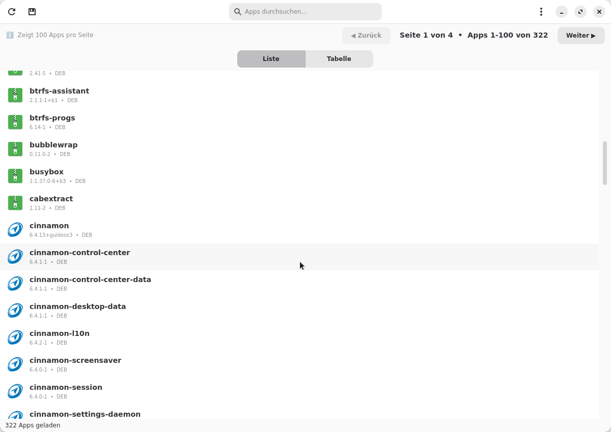
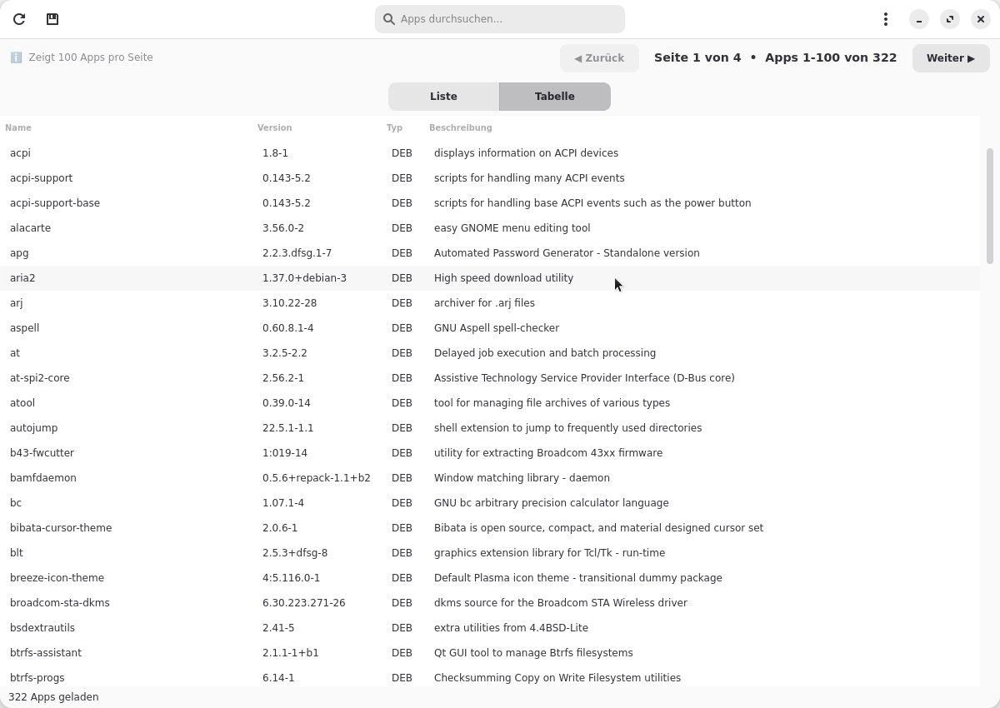
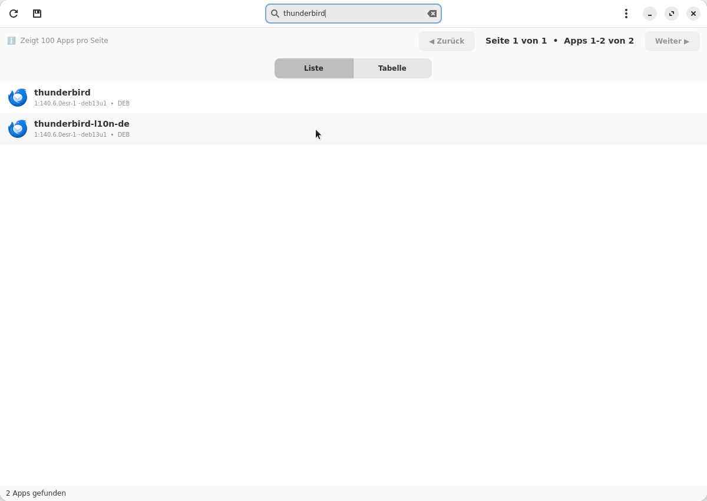
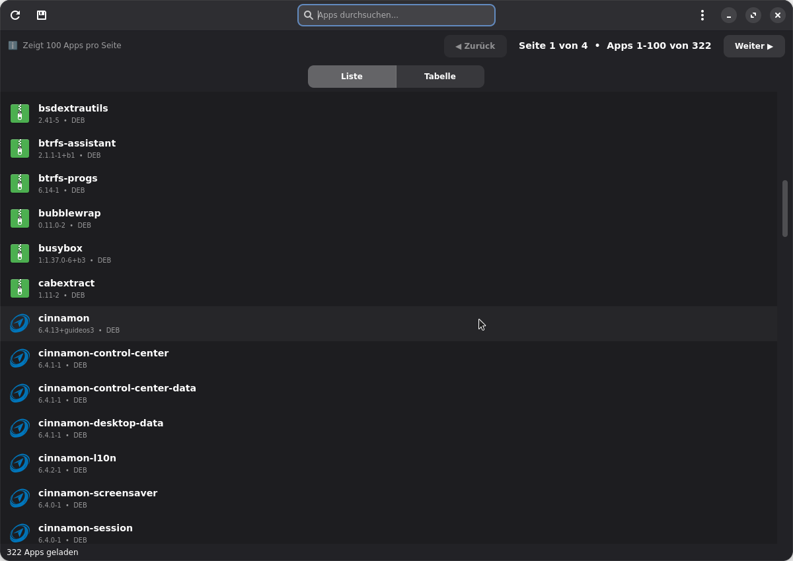

<div align="center">
  

  # MyApps

  > Tool for listing and managing installed Linux applications

  [](https://www.gnu.org/licenses/gpl-3.0)
  [](https://www.python.org/)
  [](https://github.com/nicolettas-muggelbude/myapps)
</div>

**English** | [Deutsch](README.md)

## About MyApps

MyApps is a user-friendly tool for Linux that displays all installed applications in a clean interface - without system clutter. It was developed at the request of the [Linux Guides DE Community](https://t.me/LinuxGuidesDECommunity).

### Features

✨ **Multi-Distribution Support**
- Debian, Ubuntu, Linux Mint
- Arch Linux, Manjaro
- Fedora, RHEL, CentOS
- Solus
- openSUSE
- Snap & Flatpak (cross-distribution)

🎨 **Modern Interface**
- Native GTK4 + Libadwaita integration
- Dark Mode (follows system theme)
- Virtual scrolling (10,000+ packages no problem)
- Table view & List view
- Switchable with one click
- Search function (name + description)

🔍 **Smart Filtering**
- Automatic detection of system apps
- Distribution-specific filters
- Add custom filters (right-click)
- Community-extensible

📤 **Export Functions**
- Text (TXT)
- CSV (for Excel/LibreOffice)
- JSON (for scripts)

🌍 **Multilingual**
- German
- English
- More languages welcome!

## Screenshots

### Main Window (List View)


### Table View


### Search Function


### Dark Mode


## Installation

### From DEB Package (Debian/Ubuntu/Mint)

```bash
# Download DEB package from release
sudo dpkg -i myapps_0.1.0_all.deb

# Launch
myapps
```

### As AppImage (all distributions)

```bash
# Download AppImage from release
chmod +x MyApps-0.1.0-x86_64.AppImage

# Launch
./MyApps-0.1.0-x86_64.AppImage
```

**Note:** The AppImage requires `python3`, `python3-tk` and `python3-pil` on your system:
```bash
# Debian/Ubuntu/Mint
sudo apt install python3 python3-tk python3-pil python3-pil.imagetk

# Arch/Manjaro
sudo pacman -S python tk python-pillow

# Fedora
sudo dnf install python3 python3-tkinter python3-pillow python3-pillow-tk
```

### From Source (Development)

```bash
# Clone repository
git clone https://github.com/nicolettas-muggelbude/myapps.git
cd myapps

# Create virtual environment
python3 -m venv venv
source venv/bin/activate

# Install dependencies
pip install -r requirements.txt

# Launch app
python3 -m src.myapps.main
```

## Building Packages

### Build DEB Package

```bash
# Run build script
./build-deb.sh

# Optional: Specify version
./build-deb.sh 0.1.0

# Install
sudo dpkg -i myapps_0.1.0_all.deb
```

### Build AppImage

```bash
# Download appimagetool (one-time)
wget https://github.com/AppImage/AppImageKit/releases/download/continuous/appimagetool-x86_64.AppImage
chmod +x appimagetool-x86_64.AppImage
mv appimagetool-x86_64.AppImage appimagetool

# For WSL/systems without FUSE: Extract tool
./appimagetool --appimage-extract
mv squashfs-root appimagetool-extracted

# Run build script
./build-appimage.sh

# Optional: Specify version
./build-appimage.sh 0.1.0

# Execute
chmod +x MyApps-0.1.0-x86_64.AppImage
./MyApps-0.1.0-x86_64.AppImage
```

## Usage

1. **Launch app**: Open MyApps from application menu or terminal
2. **Load packages**: All packages are loaded automatically on start
3. **Switch view**: Click "Switch View" for Table ↔ List
4. **Export**: Click "Export" and choose format
5. **Filter**: Right-click on a package → "Mark as System App"

## Supported Package Managers

| Package Manager | Distributions | Status |
|-----------------|---------------|--------|
| dpkg | Debian, Ubuntu, Mint | ✅ |
| pacman | Arch, Manjaro | ✅ |
| rpm/dnf | Fedora, RHEL, CentOS | ✅ |
| rpm/zypper | openSUSE | ✅ |
| eopkg | Solus | ✅ |
| snap | All | ✅ |
| flatpak | All | ✅ |

## Contributing

Contributions are welcome! See [CONTRIBUTING.md](CONTRIBUTING.md) for details.

### Suggest Filter Keywords

Found system packages that aren't filtered? Open an [Issue](https://github.com/nicolettas-muggelbude/myapps/issues)!

### Testers Wanted!

We need community testers for various distributions:
- Debian
- Ubuntu & variants
- Arch Linux & derivatives
- Fedora
- Solus
- openSUSE

## Roadmap

### v0.1.0 (Current - Alpha) ⏳
- [x] Multi-distribution support
- [x] Modern GUI with Dark Mode
- [x] Icons with fallback
- [x] Export functions
- [x] Multilingual (DE/EN)
- [x] Distribution-specific filters
- [x] User filters

### v0.2.0 (Planned)
- [ ] Show size information
- [ ] Performance optimizations

### v0.3.0 (Planned)
- [ ] Show installation date
- [ ] Sorting functions

### v0.4.0 (Planned)
- [ ] Check update status
- [ ] Update notifications

### v1.0.0 (Stable)
- [ ] Community testing completed
- [ ] Bug fixes
- [ ] Stable release

### v2.0.0 (Future)
- [ ] Uninstall function
- [ ] Package details view

## FAQ

**Q: Why aren't some apps shown?**
A: They were probably filtered as system apps. You can customize filters in `~/.config/myapps/user-filters.json`.

**Q: Is my distribution supported?**
A: See "Supported Package Managers" above. More distributions can be added.

**Q: Can I contribute to the filter list?**
A: Yes! Open an issue with your filter suggestions.

**Q: Is MyApps safe?**
A: MyApps is Open Source (GPLv3) and only performs read operations (no `sudo` needed). The code can be reviewed.

## License

MyApps is licensed under the [GNU General Public License v3.0](LICENSE).

## Credits

- Developed for the [Linux Guides DE Community](https://t.me/LinuxGuidesDECommunity)
- Icons from system themes
- UI based on [GTK4](https://gtk.org/) and [Libadwaita](https://gnome.pages.gitlab.gnome.org/libadwaita/)

## Support

- 🐛 [Report Bug](https://github.com/nicolettas-muggelbude/myapps/issues)
- 💡 [Suggest Feature](https://github.com/nicolettas-muggelbude/myapps/issues)
- 💬 [Community Chat](https://t.me/LinuxGuidesDECommunity)

## 💝 Support This Project

If MyApps helps you, consider supporting the development:

[](https://www.paypal.com/ncp/payment/UYJ73YNEZ3KHL)

**Donations go to:** PC-Wittfoot UG (donation manager)
**Used for:** Server costs, hardware, developer time for MyApps

**Note:** Development is done by the Linux Guides DE Community (Open Source).
PC-Wittfoot UG only manages donations, but is NOT the developer.

**Legal:**
[Impressum](https://nicolettas-muggelbude.github.io/myapps/impressum) | [Privacy Policy](https://nicolettas-muggelbude.github.io/myapps/datenschutz)

---

Made with ❤️ for the Linux Community
