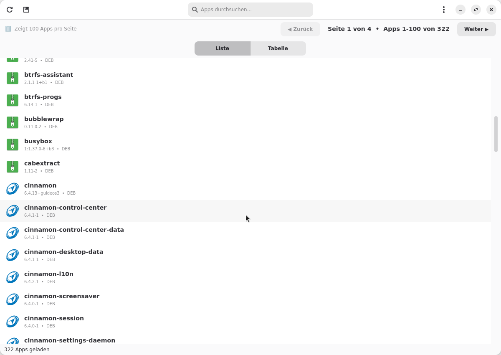
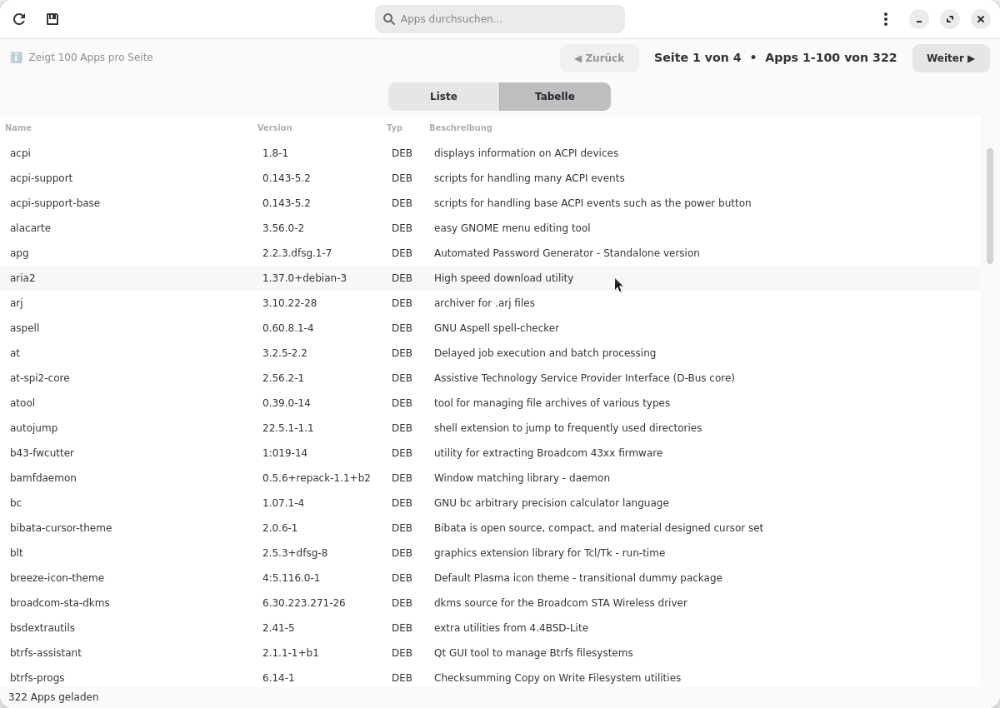
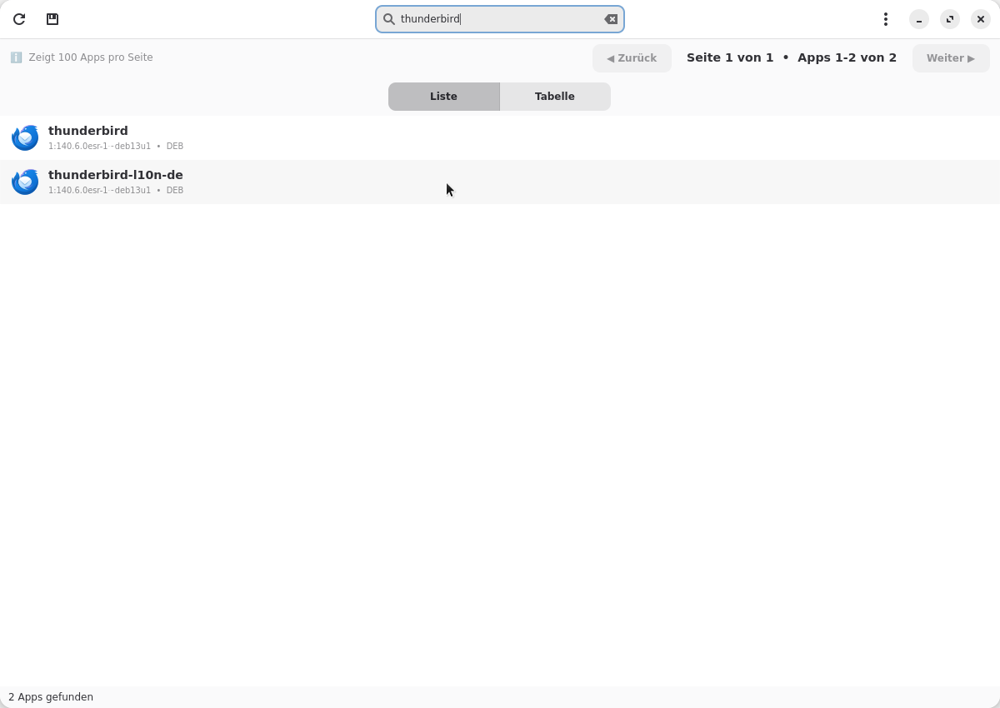
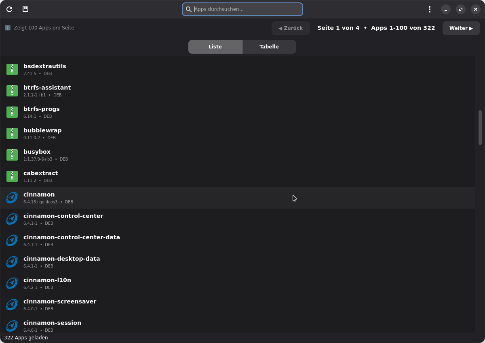

<div align="center">
  

  # MyApps

  > Tool zum Auflisten und Verwalten installierter Linux-Anwendungen

  [](https://www.gnu.org/licenses/gpl-3.0)
  [](https://www.python.org/)
  [](https://github.com/nicolettas-muggelbude/myapps/releases)
  [](https://github.com/nicolettas-muggelbude/myapps)
</div>

[English](README.en.md) | **Deutsch**

## Über MyApps

MyApps ist ein benutzerfreundliches Tool für Linux, das alle installierten Anwendungen übersichtlich darstellt - ohne System-Clutter. Es wurde auf Wunsch der Community [Linux Guides DE](https://t.me/LinuxGuidesDECommunity) entwickelt.

### Features

✨ **Multi-Distribution-Support**
- Debian, Ubuntu, Linux Mint
- Arch Linux, Manjaro
- Fedora, RHEL, CentOS
- Solus
- openSUSE
- Snap & Flatpak (distributionsübergreifend)

🎨 **Moderne Oberfläche**
- Native GTK4 + Libadwaita Integration
- Dark Mode (folgt System-Theme)
- Virtual Scrolling (10.000+ Pakete kein Problem)
- Tabellenansicht & Listenansicht

🔍 **Suche & Filter**
- Scope-Dropdown: "Nur User-Apps" oder "Alle Pakete"
- Live-Suche in Name + Beschreibung (ab 5 Zeichen)
- Automatische Erkennung von System-Apps
- Distro-spezifische Filter
- Eigene Filter hinzufügen (Rechtsklick)

🖥️ **Desktop-Apps-Ansicht**
- Dritter Tab neben Liste und Tabelle
- Zeigt installierte .desktop-Anwendungen (System, User, Flatpak, Snap)
- Lokalisierte Namen und Beschreibungen, 48px Icons

📊 **Paket-Informationen**
- Installierte Größe (dpkg, rpm, pacman, flatpak, snap)
- Installationsdatum (dpkg, rpm, pacman, flatpak, snap)
- Sortierfunktion: Name, Größe, Datum (auf- und absteigend)

🔔 **Update-Manager** *(neu in v0.4.1)*
- Update-Status-Icon in Liste und Tabelle für Pakete mit verfügbaren Updates
- Desktop-Benachrichtigung beim Start wenn Updates vorhanden (opt-in)
- Auto-Updater: MyApps aktualisiert sich selbst via pkexec (apt/dnf/zypper)
- Hinweis-Dialog für Arch/AUR mit yay/paru Befehlen

📤 **Export-Funktionen**
- Text (TXT)
- CSV (für Excel/LibreOffice)
- JSON (für Scripte)

🌍 **Mehrsprachig**
- Deutsch
- Englisch
- Weitere Sprachen willkommen!

## Screenshots

### Hauptfenster (Listenansicht)


### Tabellenansicht


### Suchfunktion


### Dark Mode


## Installation

### Voraussetzungen

**MyApps benötigt GTK4 + Libadwaita als System-Pakete:**

```bash
# Debian 12 / Linux Mint
sudo apt install python3-gi python3-gi-cairo gir1.2-gtk-4.0 gir1.2-adw-1 python3-pil

# Ubuntu 24.04 LTS (python3-pil wurde zu python3-pillow umbenannt)
sudo apt install python3-gi python3-gi-cairo gir1.2-gtk-4.0 gir1.2-adw-1 python3-pillow

# Arch/Manjaro
sudo pacman -S python-gobject gtk4 libadwaita python-pillow

# Fedora/RHEL/CentOS
sudo dnf install python3-gobject gtk4 libadwaita python3-pillow

# openSUSE
sudo zypper install python3-gobject python3-gobject-Gdk typelib-1_0-Gtk-4_0 typelib-1_0-Adw-1 python3-Pillow
```

> **Hinweis Ubuntu 24.04:** Das Paket `python3-pil` existiert dort nicht mehr — bitte `python3-pillow` verwenden.

### Aus OBS (Empfohlen - Debian/Ubuntu/Fedora/openSUSE)

**📦 Professionelle Pakete für 12 Distributionen über openSUSE Build Service:**

[](https://software.opensuse.org//download.html?project=home%3Anicoletta%3Amyapps&package=myapps)

**Debian/Ubuntu:**
```bash
# Debian 12 (Bookworm)
echo "deb https://download.opensuse.org/repositories/home:/nicoletta:/myapps/Debian_12/ /" | sudo tee /etc/apt/sources.list.d/myapps.list
wget -qO- https://download.opensuse.org/repositories/home:/nicoletta:/myapps/Debian_12/Release.key | sudo gpg --dearmor -o /etc/apt/trusted.gpg.d/myapps.gpg
sudo apt update && sudo apt install myapps

# Ubuntu 24.04 LTS
echo "deb https://download.opensuse.org/repositories/home:/nicoletta:/myapps/Ubuntu_24.04/ /" | sudo tee /etc/apt/sources.list.d/myapps.list
wget -qO- https://download.opensuse.org/repositories/home:/nicoletta:/myapps/Ubuntu_24.04/Release.key | sudo gpg --dearmor -o /etc/apt/trusted.gpg.d/myapps.gpg
sudo apt update && sudo apt install myapps
```

**Fedora:**
```bash
# Fedora 41
sudo dnf config-manager --add-repo https://download.opensuse.org/repositories/home:/nicoletta:/myapps/Fedora_41/home:nicoletta:myapps.repo
sudo dnf install myapps
```

**openSUSE:**
```bash
# openSUSE Tumbleweed
sudo zypper addrepo https://download.opensuse.org/repositories/home:/nicoletta:/myapps/openSUSE_Tumbleweed/home:nicoletta:myapps.repo
sudo zypper refresh && sudo zypper install myapps
```

**Weitere verfügbare Distributionen:**
- Debian 13 (Trixie)
- Ubuntu 22.04 LTS, 25.10, 26.04 LTS
- Fedora 42, 43
- openSUSE Leap 16, Slowroll

[Alle OBS-Pakete ansehen →](https://software.opensuse.org//download.html?project=home%3Anicoletta%3Amyapps&package=myapps)

---

### Aus AUR (Empfohlen - Arch Linux)

[](https://aur.archlinux.org/packages/myapps)

```bash
# Mit AUR Helper (z.B. yay)
yay -S myapps

# Oder mit paru
paru -S myapps

# Manuell
git clone https://aur.archlinux.org/myapps.git
cd myapps
makepkg -si
```

### Aus GitHub DEB-Paket (⚠️ Nur für Testing)

**⚠️ WARNUNG:** Dieses Paket ist NUR für Testing/Development gedacht!

**Für Production bitte OBS-Pakete nutzen** (siehe oben).

```bash
# Nach dem Download installieren
sudo dpkg -i myapps_1.0.0_all.deb

# Falls Dependencies fehlen
sudo apt-get install -f

# Starten
myapps
```

### ~~Als Flatpak~~ (Nicht verfügbar)

**Flathub hat MyApps abgelehnt** aufgrund benötigter `/var/lib` Zugriffe für Paketmanager-Datenbanken.

**Alternative:** Nutze **OBS-Pakete** (siehe oben) - diese bieten native System-Integration ohne Sandbox-Einschränkungen.

### ~~Als AppImage~~ (discontinued ab v0.2.0)

AppImage wird ab v0.2.0 nicht mehr angeboten, da GTK4-System-Dependencies schwer zu bundeln sind.

### Aus Quellcode (Development)

```bash
# Repository klonen
git clone https://github.com/nicolettas-muggelbude/myapps.git
cd myapps

# 1. System-Pakete installieren (PFLICHT - GTK4 kann nicht via pip gebaut werden!)
# Ubuntu 24.04:
sudo apt install python3-gi python3-gi-cairo gir1.2-gtk-4.0 gir1.2-adw-1 python3-pillow
# Ubuntu 22.04 / Debian 12:
sudo apt install python3-gi python3-gi-cairo gir1.2-gtk-4.0 gir1.2-adw-1 python3-pil

# 2. venv MIT --system-site-packages (damit python3-gi verfügbar ist)
python3 -m venv --system-site-packages venv
source venv/bin/activate

# 3. Nur Pillow via pip (PyGObject kommt vom System)
pip install -e . --no-deps
pip install Pillow

# 4. App starten
python3 -m myapps.main
# oder einfach:
./run-dev.sh
```

> **Wichtig:** `pip install -e .` **ohne** `--no-deps` schlägt fehl, weil pip versucht PyGObject zu kompilieren — das benötigt `pkg-config` + `libcairo2-dev`. GTK-Bindings müssen als System-Paket kommen.

## Pakete selbst bauen
 
### DEB-Paket bauen

```bash
# Build-Script ausführen
./build-deb.sh

# Optional: Spezifische Version
./build-deb.sh 1.0.0

# Installieren
sudo dpkg -i myapps_1.0.0_all.deb
```

## Verwendung

1. **App starten**: Öffne MyApps aus dem Anwendungsmenü oder Terminal
2. **Pakete laden**: Beim Start werden automatisch alle User-Apps geladen
3. **Scope wechseln**: Dropdown neben der Suche → "Nur User-Apps" oder "Alle Pakete"
4. **Suchen**: Mindestens 5 Zeichen eingeben für Live-Suche
5. **Sortieren**: Dropdown in der Navigationsleiste → nach Name, Größe oder Datum
6. **Ansicht wechseln**: Buttons oben → Liste, Tabelle oder Desktop
7. **Exportieren**: Klicke auf "Exportieren" und wähle das Format (TXT/CSV/JSON)
8. **Filtern**: Rechtsklick auf ein Paket → "Als System-App markieren"
9. **Updates**: Pakete mit verfügbarem Update zeigen ein Icon — Banner oben zum Aktualisieren

## Unterstützte Paketmanager

| Paketmanager | Distributionen | Größe | Datum | Updates |
|--------------|----------------|-------|-------|---------|
| dpkg | Debian, Ubuntu, Mint | ✅ | ✅ | ✅ |
| pacman | Arch, Manjaro | ✅ | ✅ | ✅ |
| rpm/dnf | Fedora, RHEL, CentOS | ✅ | ✅ | ✅ |
| rpm/zypper | openSUSE | ✅ | ✅ | ✅ |
| flatpak | Alle | ✅ | ✅ | ✅ |
| snap | Alle | ✅ | ✅ | ✅ |
| eopkg | Solus | — | — | — |

## Roadmap

### v0.2.x (GTK4 Migration) ✅
- [x] GTK4 + Libadwaita GUI, Suchfunktion, OBS-Pakete (12 Distros), AUR

### v0.3.x ✅
- [x] Scope-Dropdown, Größe, Datum, Sortierung, Desktop-Apps-Ansicht

### v0.4.0 ✅
- [x] Virtual Scrolling (keine Pagination mehr)
- [x] Update-Benachrichtigung (Banner bei neuer Version)
- [x] OBS-Repo wird beim Install automatisch eingetragen

### v0.4.1 ✅
- [x] Update-Status-Icon pro Paket in Liste und Tabelle
- [x] Desktop-Benachrichtigungen via notify-send (opt-in)
- [x] Auto-Updater via pkexec (apt/dnf/zypper), Hinweis für Arch/AUR

### v1.0.1 (Aktuell) ✅
- [x] Fix: Auto-Updater führt apt update vor Install aus (Endlosschleife behoben)

### v1.0.0 ✅
- [x] Stable Release nach Community-Testing
- [x] UPDATE-Badge neben App-Namen in Liste und Tabelle
- [x] apt-get update via pkexec vor dem Paket-Update-Check

### v2.0.0 (Zukunft)
- [ ] Deinstallations-Funktion

## Häufige Fragen

### Installation & Updates

**Q: Wie bekomme ich Updates?**
A: Ab v0.4.0 trägt das Installationspaket das OBS-Repo automatisch ein. Danach reicht ein normales:
```bash
sudo apt update && sudo apt upgrade        # Debian/Ubuntu/Mint
sudo dnf upgrade myapps                    # Fedora
sudo zypper update myapps                  # openSUSE
yay -Syu myapps                            # Arch (AUR)
```

**Q: MyApps zeigt einen Banner "Neue Version verfügbar" — wie installiere ich das Update?**
A: Ab v0.4.1 kannst du direkt im Banner auf "Aktualisieren" klicken (apt/dnf/zypper). Für Arch/AUR erscheint ein Hinweis-Dialog mit dem passenden yay/paru Befehl.

**Q: Ich habe MyApps als .deb installiert und bekomme keine Updates über `apt upgrade`.**
A: Das OBS-Repo wurde nur bei Installationen ab v0.4.0 automatisch eingetragen. Bei älteren Installationen bitte das Repo manuell einrichten — siehe Abschnitt "Aus OBS" oben.

**Q: Warum gibt es kein Flatpak?**
A: MyApps benötigt Zugriff auf `/var/lib/` für Paketmanager-Datenbanken. Flathub erlaubt diesen Zugriff aus Sicherheitsgründen nicht und hat die Einreichung abgelehnt. Als Alternative bieten wir native OBS-Pakete für 12 Distributionen an.

---

### Anwendungszentrum (GNOME Software)

**Q: Das Anwendungszentrum zeigt "Möglicherweise unsicher" oder "Lizenz unbekannt".**
A: GNOME Software zeigt diese Warnung bei Paketen aus Drittquellen (nicht Distro-eigene Repos oder Flathub). Das ist keine Fehlfunktion von MyApps — MyApps ist Open Source (GPLv3) und vollständig sicher. Die Warnung ist eine allgemeine GNOME Software Policy.

**Q: Der "Installieren"-Button im Anwendungszentrum ist ausgegraut.**
A: GNOME Software kann nur Pakete installieren, die in einer konfigurierten Quelle liegen. Bitte installiere MyApps über die Terminal-Anleitung oben. Nach der Installation und dem nächsten `apt update` wird das OBS-Repo erkannt.

---

### Pakete & Anzeige

**Q: Warum werden manche Apps nicht angezeigt?**
A: Sie wurden als System-Apps gefiltert. Wechsle im Scope-Dropdown zu "Alle Pakete" oder passe eigene Filter in `~/.config/myapps/user-filters.json` an. Einzelne Apps können auch per Rechtsklick → "Als System-App markieren" ausgeblendet werden.

**Q: Die Suche findet nichts obwohl ich etwas eingebe.**
A: Die Suche erfordert mindestens 5 Zeichen. Die Statusleiste zeigt an wie viele Zeichen noch fehlen.

**Q: Wird meine Distribution unterstützt?**
A: Debian, Ubuntu, Linux Mint, Arch, Fedora, openSUSE, Solus sowie Flatpak und Snap werden unterstützt. Weitere Distributionen können über Issues vorgeschlagen werden.

**Q: Ist MyApps sicher?**
A: Ja. MyApps ist Open Source (GPLv3), führt nur lesende Operationen durch und benötigt kein `sudo`. Der Quellcode ist auf GitHub einsehbar.

---

### Entwicklung

**Q: `pip install -e .` schlägt fehl mit pycairo-Fehler?**
A: GTK-Bindings können nicht via pip kompiliert werden. Installiere `python3-gi` als System-Paket und nutze `pip install -e . --no-deps`. Siehe Abschnitt "Aus Quellcode" oben.

**Q: Ubuntu 24.04: `python3-pil` nicht gefunden?**
A: In Ubuntu 24.04 wurde das Paket zu `python3-pillow` umbenannt. Nutze `sudo apt install python3-pillow`.

## Beitragen

Beiträge sind herzlich willkommen! Siehe [CONTRIBUTING.md](CONTRIBUTING.md) für Details.

## Lizenz

MyApps ist unter der [GNU General Public License v3.0](LICENSE) lizenziert.

## Credits

- Entwickelt für die [Linux Guides DE Community](https://t.me/LinuxGuidesDECommunity)
- Icons aus System-Themes
- UI basiert auf [GTK4](https://www.gtk.org/) und [Libadwaita](https://gnome.pages.gitlab.gnome.org/libadwaita/)

## Support

- 🐛 [Bug melden](https://github.com/nicolettas-muggelbude/myapps/issues)
- 💡 [Feature vorschlagen](https://github.com/nicolettas-muggelbude/myapps/issues)
- 💬 [Community-Chat](https://t.me/LinuxGuidesDECommunity)

---

*Gemacht mit ❤️ für die Linux-Community*
